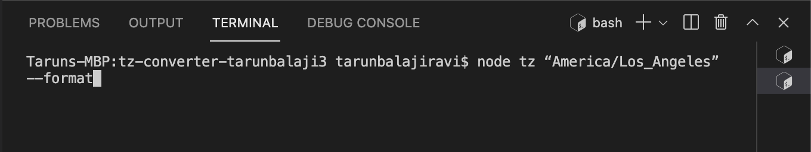
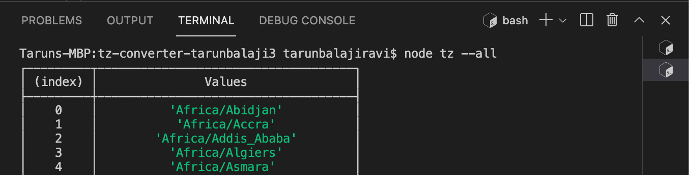
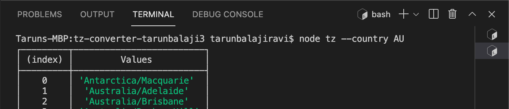

# Time Zone Converter

## App Behavior

This app allows you to find the timezones of various locations by passing in arguments to the command line. The default timezone is set to 'America/New_York." If the app is called without arguments, a usage message will be printed to the console.

## Instructions

Use the command line to find the timezones in different parts of the world. For example, if you wanted to find the time in Los Angeles, in a neatly formatted way, pass the following argument to the command line using the --format flag:

In order to get a list of all timezones avaliable, pass the following argument to the command line using the --all flag:

In order to get a list of all timezones avaliable in a specific country, pass the following argument to the command line using the --all flag and the country's 2-letter code:

